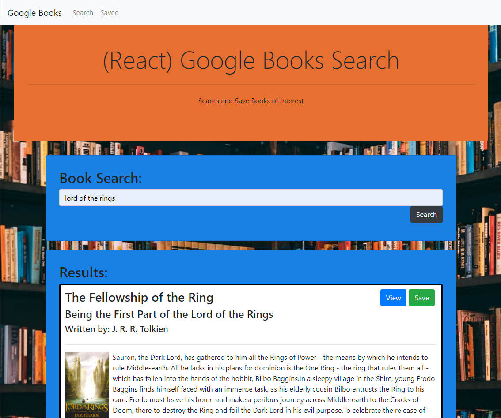
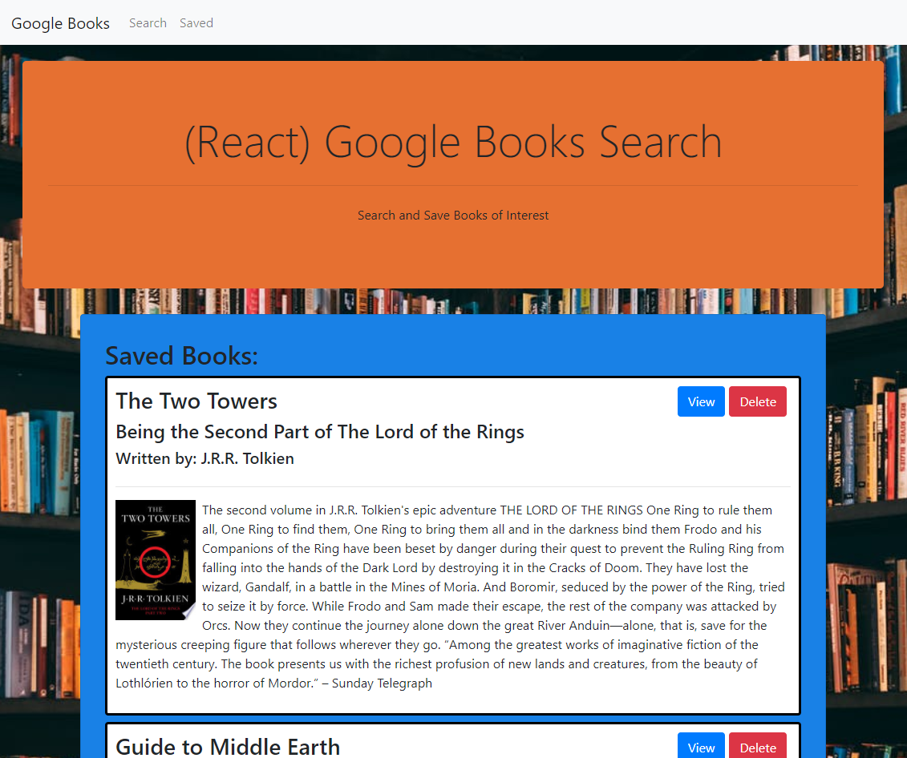

# Google Books Search

Use this Google Book Search application to find, save and view your favorite books with Google Books.

## Table of Contents

1. [Usage](#Usage)
1. [Languages and Concepts](#Languages-and-Concepts)
1. [Demo](#Demo)
1. [Roadmap](#Roadmap)
1. [Links](#Links)
1. [Contact](#Contact)
1. [Contributing](#Contributing)
1. [License](#License)

## Usage

This application allows the user to search for various book titles using the Google Books API. Once results are retrieved, the user will be able to view the book in the Google Books store or save it to the database. On the Saved page, they will be able to view all the books they have previously saved and delete them if needed.

## Languages and Concepts

- [React.js](https://reactjs.org/)
- [MongoDB](https://www.mongodb.com/)
- [Mongoose](https://mongoosejs.com/)
- [React Router](https://reactrouter.com/)
- [Google Books API](https://developers.google.com/books/docs/overview#books_api_v1)
- [Express](https://expressjs.com/)
- [Axios](https://www.npmjs.com/package/axios)
- [Bootstrap](https://getbootstrap.com/)

## Demo

## Roadmap

To further this project, I would like to add a notification feature that notifies the user when they complete an action: saving or deleting a book. I would like the user to be notified if they already have that book saved by either a pop-up message or having the save button disabled with a message as to why. I would like to add a sort/search function for the saved books. And I would like for the API call to retrieve additional books as the user saves books so the list is continually refilling.

## Links

- [See it live]()
- [Project Repository](https://github.com/ncmarsh/google_books_search)

## Contact

- Nicole Marshall - [@ncmarsh](https://github.com/ncmarsh)

## Contributing

This is a personal project; no contributions are required at this time.

## License

No license granted.

##### [Return to Top of Page](#Google-Books-Search)